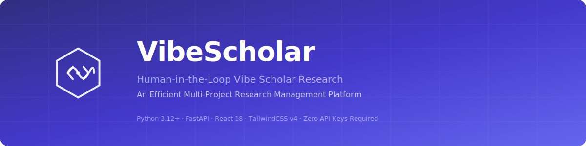
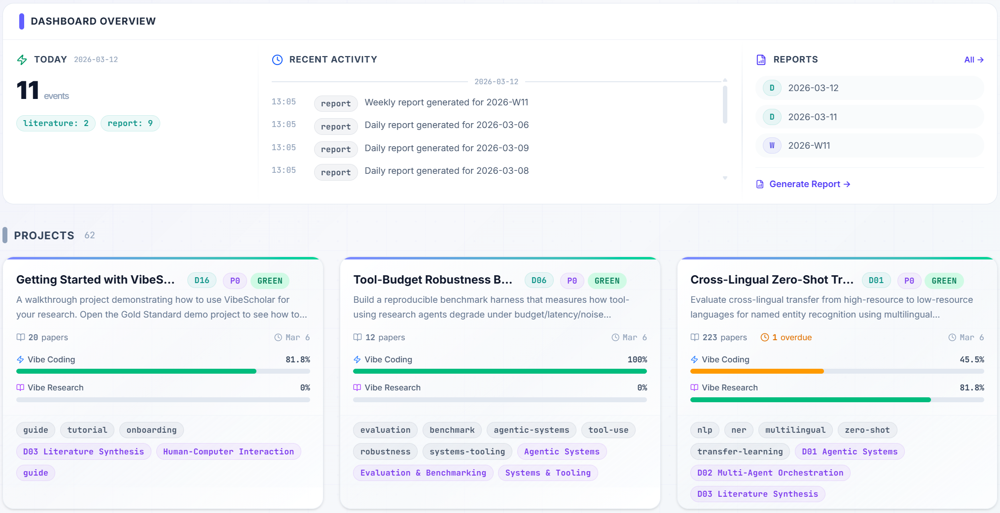
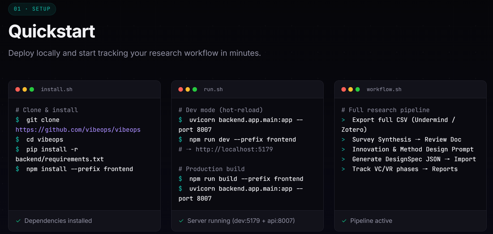
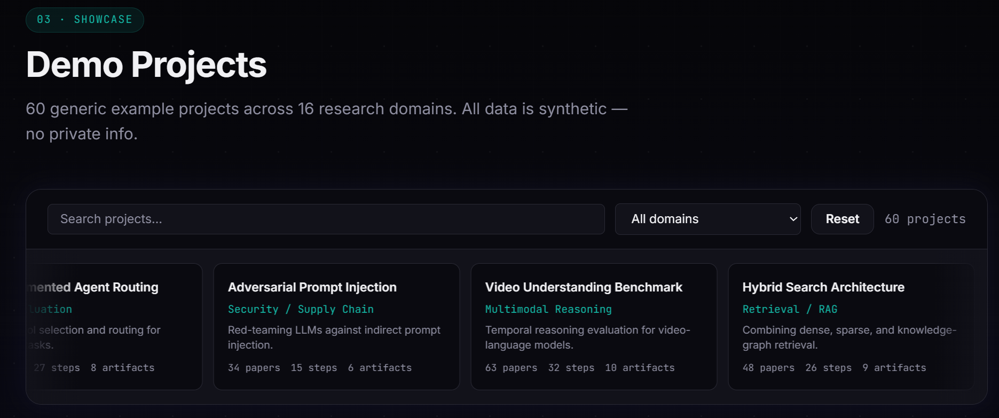
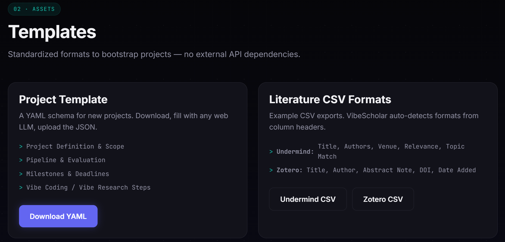
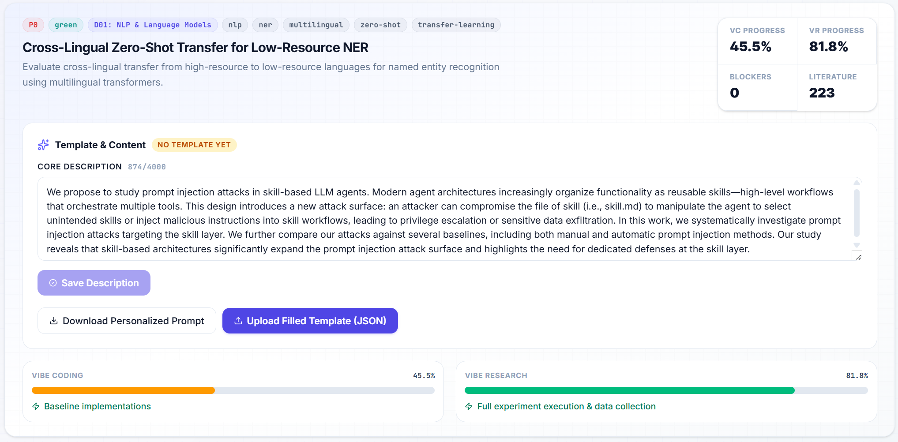
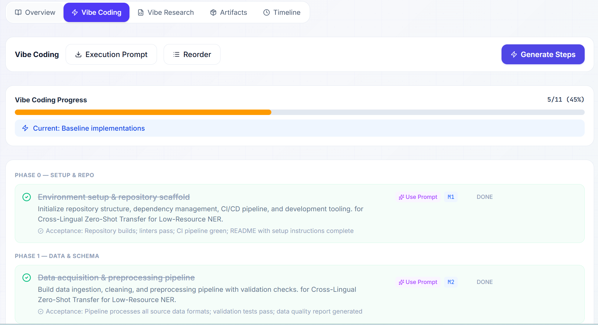
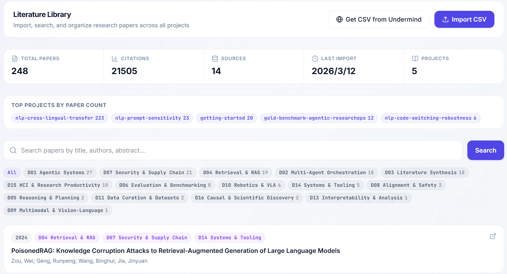
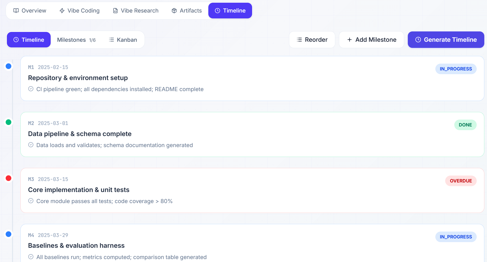

<p align="center">
  
</p>
 
<p align="center">
  <a href="#quickstart"></a>
  <a href="#features"></a>
  <a href="YOUR_GITHUB_LINK_HERE"></a>
  <a href="#contact"></a>
</p>
 
<p align="center">
  
  
  
  
  
  
</p>
 
---
 
## What is VibeScholar?

**VibeScholar** is a human-in-the-loop research operations and productivity tool built for researchers who manage multiple projects at once. It structures the full research lifecycle into executable, traceable workflows:

```
Idea → Literature Review → Method & Evaluation Design → Vibe Coding → Vibe Research → Reports & Timeline
```

By default, VibeScholar runs in **0-API monitor mode**: you import templates and literature CSVs, log progress and artifacts, and the system keeps structured overviews, step trackers, timelines, and daily/weekly reports up to date. When you have API budget, you may optionally enable more automation for literature triage and related workflows — but the **core experience remains human-in-the-loop and cost-efficient**.

<p align="center">
  
  <br/>
  <sub><b>Fig 1.</b> VibeScholar Dashboard — multi-project overview with progress tracking, priority flags, and quick navigation.</sub>
</p>
 
---
 
## Features
 
<table>
<tr>
<td width="50%">
 
### Multi-Project Management
- Track **62+ research projects** across 16 domains simultaneously
- Priority flags (P0–P3), RAG status indicators, domain tagging
- Unified dashboard with search, sort, and filter
 
### Structured Research Lifecycle
- **Overview** → structured project definition with auto-parsed sections
- **Execution** → Vibe Coding + Vibe Research step trackers with acceptance criteria
- **Literature** → Import from Undermind / Zotero CSV, auto-normalize
- **Timeline** → Milestones, Kanban board, weekly progress snapshots
- **Artifacts** → Link deliverables to milestones and steps
 
</td>
<td width="50%">
 
### Zero-API Monitor Mode
- No API keys required for core functionality
- Fill JSON templates using any web LLM (ChatGPT, Claude, Gemini)
- Upload the result and the system structures everything automatically
 
### Smart Template System
- JSON project template with prompt instructions
- AI-assisted template filling (copy prompt → paste to any LLM → upload JSON)
- Auto-generates: overview, VC/VR steps, milestones, artifacts index
 
### Automated Reports
- Daily / weekly / on-demand progress reports
- Per-project and cross-project aggregation
- Markdown export for sharing
 
</td>
</tr>
</table>
 
---

## Quickstart

### Prerequisites

| Tool    | Version | Check               |
| ------- | ------- | ------------------- |
| Python  | 3.12+   | `python3 --version` |
| Node.js | 20+     | `node --version`    |
| npm     | 10+     | `npm --version`     |

### 1. Clone & Install

```bash
git clone https://github.com/Mr-Tieguigui/Vibe-Scholar.git
cd VibeScholar

# Conda
conda create -n vibescholar python=3.10
conda activate vibesholar

# Backend
cd backend
pip install -r requirements.txt

# Frontend
cd ../frontend
npm install
```

### 2. Build & Run

```bash
# Build the frontend
cd frontend
npm run build

# Start the production server (serves both API + frontend)
cd ..
python3 -m uvicorn backend.app.main:app --host 127.0.0.1 --port 8007
```

Open **http://127.0.0.1:8007** in your browser.

### 3. Development Mode (hot-reload)

```bash
# Terminal 1 — Backend
cd backend
uvicorn app.main:app --host 127.0.0.1 --port 8007 --reload

# Terminal 2 — Frontend
cd frontend
npm run dev
```

Frontend dev server runs on `http://localhost:5176` and proxies API requests to the backend.

<p align="center">
  
  <br/>
  <sub><b>Fig 2.</b> Built-in Quickstart guide — interactive onboarding walkthrough.</sub>
</p>
 
---
 
## Project Structure
 
```
VibeScholar/
├── backend/                   # FastAPI backend
│   ├── app/
│   │   ├── main.py            # App entry point + template import endpoint
│   │   ├── config.py          # pydantic-settings configuration
│   │   ├── schemas.py         # Pydantic V2 request/response models
│   │   ├── routers/           # API route modules
│   │   │   ├── projects.py    # Project CRUD + summary
│   │   │   ├── reports.py     # Report generation
│   │   │   ├── designspec.py  # DesignSpec validation + generation
│   │   │   └── ...
│   │   ├── overview_parser.py # Markdown → structured JSON parser
│   │   ├── step_generator.py  # Auto-generate VC/VR execution steps
│   │   └── utils.py           # File I/O helpers (YAML, JSON, MD)
│   ├── requirements.txt
│   └── tests/
├── frontend/                  # React 18 + TypeScript + TailwindCSS v4
│   ├── src/
│   │   ├── components/        # Layout, ThemeProvider, shared UI
│   │   ├── pages/             # Dashboard, Project, Settings, Quickstart
│   │   └── api.ts             # Backend API client
│   ├── index.html
│   └── vite.config.ts
├── config/
│   ├── projects.yaml          # Project registry (id, name, domain, tags)
│   ├── providers.yaml         # AI provider config (optional, keys empty)
│   └── ui.yaml                # UI theme + sidebar layout
├── projects/                  # 62 demo projects across 16 research domains
│   ├── getting-started/       # Onboarding tutorial project
│   ├── gold-benchmark-.../    # Gold standard reference project
│   └── ...                    # Domain-specific demo projects
├── templates/                 # Project + literature templates
│   ├── vibeops_project_template.json
│   ├── project_content_template.yaml
│   └── prompt/                # LLM prompt templates
├── scripts/
│   └── deploy_prod.sh         # One-command production deploy
├── docs/
│   ├── images/                # Screenshots and diagrams
│   └── GOLD_STANDARD_QA.md   # Quality checklist for demo data
├── DEV_GUIDE.md               # Developer guide
└── README.md                  # This file
```
 
---
 
## Demo Projects — 16 Research Domains
 
VibeScholar ships with **62 synthetic demo projects** covering the breadth of modern AI/ML research:
 
| Domain | Example Projects |
|--------|-----------------|
| **NLP & Language** | Long-Context Retrieval, Instruction Following, Cross-Lingual Transfer |
| **Computer Vision** | Efficient ViT, 3D Reconstruction, OOD Detection |
| **Agents & Planning** | Memory Architecture, Tool Selection, Self-Correction |
| **Safety & Alignment** | Jailbreak Taxonomy, Red-Teaming Automation, Constitutional AI |
| **Evaluation & Benchmarks** | Dynamic Benchmark, Contamination Detection, Human Agreement |
| **Deep Learning Theory** | Scaling Laws, Loss Landscape, Grokking |
| **Multimodal** | Document QA, Chart Understanding, Audio-Visual Sync |
| **Robotics** | Sim-to-Real, Safety Constraints, Language Grounding |
| **Knowledge Graphs** | LLM Extraction, Temporal Reasoning, Embedding Evaluation |
| **Generation** | Controllable Diffusion, Video Consistency, Watermarking |
| **Data Engineering** | Data Attribution, Deduplication, Synthetic Quality |
| **RL & Multi-Agent** | Reward Hacking, Offline-to-Online, Multi-Agent Coordination |
| **HCI** | AI Pair Programming, Trust Calibration, Collaborative Writing |
| **Ethics** | Audit Framework, Copyright Detection, Environmental Cost |
| **Bioinformatics** | Drug Interaction, Protein Function, Single Cell |
| **Systems** | Distributed Training, Inference Optimization, KV Cache |
 
 
<p align="center">
  
  <br/>
  <sub><b>Fig 43.</b> Demo projects grid — 62 projects across 16 research domains with search and domain filters.</sub>
</p>
 
---
 
## API Endpoints
 
| Method | Path | Description |
|--------|------|-------------|
| `GET` | `/api/v1/health` | Health check |
| `GET` | `/api/v1/projects` | List all projects with summaries |
| `GET` | `/api/v1/projects/{id}` | Full project detail |
| `POST` | `/api/v1/projects/{id}/import_template` | Import JSON template |
| `GET` | `/api/v1/templates/project_content` | Download project template |
| `GET` | `/api/v1/reports/daily` | Generate daily report |
| `GET` | `/api/v1/reports/weekly` | Generate weekly report |
| `POST` | `/api/v1/designspec/{id}/generate` | Generate design specification |
 
Full API docs available at `http://127.0.0.1:8007/docs` (Swagger UI) after starting the server.
 
---
 
## Template Workflow
 
<p align="center">
  
  <br/>
  <sub><b>Fig 4.</b> Template workflow — fill with any LLM, upload JSON, auto-generate project structure.</sub>
</p>
 
```
┌─────────────────────────────────────────────────────────────────┐
│  1. Download template    →  GET /api/v1/templates/project_content│
│  2. Copy prompt to LLM   →  ChatGPT / Claude / Gemini          │
│  3. Paste your topic      →  "My project is about [TOPIC]"      │
│  4. Get filled JSON       →  LLM returns complete JSON           │
│  5. Upload to VibeScholar →  POST /api/v1/projects/{id}/import  │
│  6. Auto-generated:       →  Overview, VC/VR steps, Milestones  │
└─────────────────────────────────────────────────────────────────┘
```
 
---
 
## Literature Import
 
VibeScholar auto-detects CSV formats from column headers:
 
| Source | Key Columns |
|--------|-------------|
| **Undermind** | Title, Authors, Venue, Relevance Score, Topic Match |
| **Zotero** | Title, Author, Abstract Note, DOI, Date Added |
 
Simply export a CSV from your preferred tool and upload via the dashboard. The system normalizes, deduplicates, and links papers to your project.


---

## Tech Stack

| Layer              | Technology                                                   |
| ------------------ | ------------------------------------------------------------ |
| **Backend**        | Python 3.12, FastAPI, Pydantic V2, Uvicorn                   |
| **Frontend**       | React 18, TypeScript, TailwindCSS v4, Vite 7, React Query    |
| **Data**           | Plain text files (YAML, JSON, Markdown) — no database needed |
| **AI Integration** | Optional — any OpenAI/Anthropic/Google compatible API        |
| **Deployment**     | Single command (`scripts/deploy_prod.sh`)                    |

---

## Screenshots Gallery

<table>
<tr>
<td width="50%">
<p align="center">
  
  <br/><sub><b>Settings</b> — Theme, data path, export</sub>
</p>
</td>
<td width="50%">
<p align="center">
  
  <br/><sub><b>Execution</b> — Vibe Coding & Research steps</sub>
</p>
</td>
</tr>
<tr>
<td width="50%">
<p align="center">
  
  <br/><sub><b>Literature</b> — Imported papers with metadata</sub>
</p>
</td>
<td width="50%">
<p align="center">
  
  <br/><sub><b>Timeline</b> — Milestones and Kanban board</sub>
</p>
</td>
</tr>
</table>
 
---
 
## Contributing
 
Contributions are welcome! Please read the [DEV_GUIDE.md](DEV_GUIDE.md) for development setup, coding standards, and architecture details.
 
1. Fork the repository
2. Create a feature branch (`git checkout -b feature/amazing-feature`)
3. Commit your changes (`git commit -m 'Add amazing feature'`)
4. Push to the branch (`git push origin feature/amazing-feature`)
5. Open a Pull Request
 
---
 
## License
 
This project is licensed under **CC BY-SA 4.0**. No telemetry, no cloud database, fully local.
 
---
 
<p align="center">
  
  <br/>
  <sub>Built with care for the research community.</sub>
</p>
