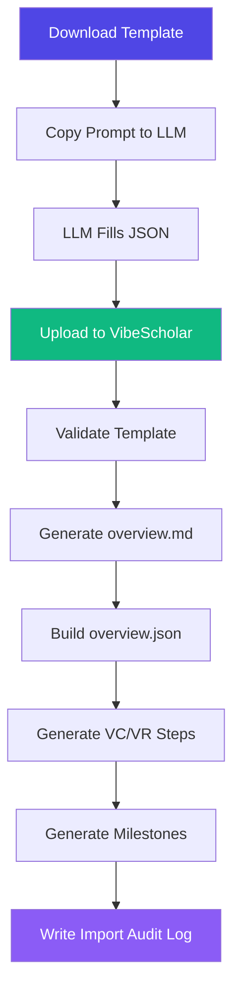

# VibeScholar Developer Guide

<p align="center">
  
</p>

> Complete guide for developing, extending, and deploying VibeScholar.

---

## Table of Contents

- [Development Environment](#development-environment)
- [Architecture Overview](#architecture-overview)
- [Backend Deep Dive](#backend-deep-dive)
- [Frontend Deep Dive](#frontend-deep-dive)
- [Data Model](#data-model)
- [Core Workflows](#core-workflows)
- [Testing](#testing)
- [Deployment](#deployment)
- [Extending VibeScholar](#extending-vibescholar)

---

## Development Environment

### Prerequisites

| Tool | Version | Install |
|------|---------|---------|
| Python | 3.12+ | [python.org](https://python.org) or Miniconda |
| Node.js | 20+ | [nodejs.org](https://nodejs.org) or nvm |
| npm | 10+ | Bundled with Node.js |
| Git | 2.40+ | [git-scm.com](https://git-scm.com) |

### Quick Setup

```bash
# 1. Clone
git clone YOUR_GITHUB_LINK_HERE
cd VibeScholar

# 2. Backend dependencies
cd backend
pip install -r requirements.txt

# 3. Frontend dependencies
cd ../frontend
npm install
```

### Starting Dev Servers

```bash
# Terminal 1 — Backend (auto-reload)
cd backend
python3 -m uvicorn app.main:app --host 127.0.0.1 --port 8007 --reload

# Terminal 2 — Frontend (HMR)
cd frontend
npm run dev
```

- **Backend API:** http://127.0.0.1:8007/docs (Swagger UI)
- **Frontend Dev:** http://localhost:5176 (proxies `/api` → backend)

### Port Cleanup

```bash
fuser -k 8007/tcp   # backend
fuser -k 5176/tcp   # frontend dev
```

---

## Architecture Overview

```
┌─────────────────────────────────────────────────────────┐
│                    Browser (React SPA)                    │
│  ┌──────────┐ ┌──────────┐ ┌──────────┐ ┌────────────┐ │
│  │Dashboard │ │ Project  │ │Literature│ │  Reports   │ │
│  │  Page    │ │  Detail  │ │  Page    │ │   Page     │ │
│  └────┬─────┘ └────┬─────┘ └────┬─────┘ └─────┬──────┘ │
│       └─────────────┴────────────┴─────────────┘        │
│                         │ api.ts                         │
└─────────────────────────┼───────────────────────────────┘
                          │ HTTP (JSON)
┌─────────────────────────┼───────────────────────────────┐
│                    FastAPI Backend                        │
│  ┌──────────┐ ┌──────────┐ ┌──────────┐ ┌────────────┐ │
│  │projects  │ │literature│ │ reports  │ │ designspec │ │
│  │ router   │ │  router  │ │  router  │ │   router   │ │
│  └────┬─────┘ └────┬─────┘ └────┬─────┘ └─────┬──────┘ │
│       └─────────────┴────────────┴─────────────┘        │
│                         │                                │
│  ┌─────────────┐ ┌─────────────┐ ┌──────────────────┐  │
│  │  overview   │ │    step     │ │    template      │  │
│  │  parser     │ │  generator  │ │   validator      │  │
│  └─────────────┘ └─────────────┘ └──────────────────┘  │
└─────────────────────────┼───────────────────────────────┘
                          │ File I/O
┌─────────────────────────┼───────────────────────────────┐
│              Plain-Text File System                       │
│  config/   projects/   templates/   reports/   data/     │
│  (YAML)    (YAML/JSON/ (JSON/YAML)  (MD)      (CSV)     │
│             MD/JSONL)                                     │
└─────────────────────────────────────────────────────────┘
```

<p align="center">
  
  <br/>
  <sub><b>Fig 1.</b> System architecture — React SPA communicates with FastAPI backend over REST; all data stored as plain text files.</sub>
</p>

---

## Backend Deep Dive

### Entry Point

`backend/app/main.py` — FastAPI application with:
- Router mounts for projects, literature, reports, designspec
- Template download/upload endpoints
- Maintenance endpoints (reindex, rebuild, export)
- SPA static file serving (serves built frontend from `frontend/dist/`)

### Key Modules

| Module | Purpose |
|--------|---------|
| `config.py` | `pydantic-settings` — API prefix, dynamic data paths, env overrides |
| `schemas.py` | All Pydantic V2 request/response models |
| `utils.py` | Atomic file writes, YAML/JSON/JSONL I/O, file locks |
| `overview_parser.py` | Markdown → structured JSON (concepts, milestones, risks, pipeline) |
| `overview_builder.py` | Template dict → structured overview JSON (no lossy MD round-trip) |
| `plan_generator.py` | Generate experiment & paper plans from overview JSON |
| `step_generator.py` | Generate VC/VR execution steps from overview JSON |
| `template_validator.py` | Strict JSON schema validation for project templates |
| `tag_taxonomy.py` | Domain/pillar taxonomy for project classification |
| `events.py` | FastAPI lifespan event handlers |

### Routers

| Router | Prefix | Key Endpoints |
|--------|--------|---------------|
| `projects.py` | `/api/v1/projects` | GET list, GET detail, POST create, DELETE, PATCH update, plans, execution, timeline, artifacts |
| `literature.py` | `/api/v1/literature` | Paper management, CSV import (Undermind/Zotero auto-detect), stats, search |
| `reports.py` | `/api/v1/reports` | Daily/weekly report generation with cross-project aggregation |
| `designspec.py` | `/api/v1/designspec` | Design specification generation and validation |

### Configuration

All settings support environment variable overrides with `VIBECR_` prefix:

```bash
export VIBECR_PORT=9000        # Override default port 8007
export VIBECR_HOST=0.0.0.0    # Bind to all interfaces
```

---

## Frontend Deep Dive

### Tech Stack

| Library | Version | Purpose |
|---------|---------|---------|
| React | 18 | UI framework |
| TypeScript | 5.x | Type safety |
| Vite | 7 | Build tool + HMR |
| TailwindCSS | v4 | Utility-first CSS with `@theme` tokens |
| React Query | v5 | Server state management |
| React Router | v6 | Client-side routing |
| Lucide React | latest | Icon library |
| react-markdown | latest | Markdown rendering |

### Design System (`index.css`)

```css
@theme {
  --color-brand: #4f46e5;      /* indigo-600 */
  --radius-card: 14px;
  --radius-row: 10px;
  --radius-input: 8px;
}
```

### Pages

| Page | Route | Description |
|------|-------|-------------|
| `HomePage` | `/` | Project dashboard with cards, search, sort, filter, create/delete modals |
| `ProjectPage` | `/projects/:id` | Tabbed detail: Overview, Plans, Execution, Literature, Artifacts, Timeline |
| `LiteraturePage` | `/literature` | Cross-project literature stats, CSV upload, paper table |
| `QuickstartPage` | `/quickstart` | Interactive onboarding walkthrough |
| `ReportsPage` | `/reports` | Daily/weekly report generation |
| `SettingsPage` | `/settings` | System info, data paths, export, maintenance |

<p align="center">
  
  <br/>
  <sub><b>Fig 2.</b> Project detail — tabbed interface for overview, execution steps, literature, artifacts, and timeline.</sub>
</p>

### Component Patterns

**Inline Editing** (Steps, Milestones, Kanban):
```tsx
function EditableRow({ item, onSave }) {
  const [editing, setEditing] = useState(false)
  const [field, setField] = useState(item.field)
  const handleSave = () => {
    const update = {}
    if (field !== item.field) update.field = field
    if (Object.keys(update).length > 0) onSave(update)
    setEditing(false)
  }
  // Display view with group-hover Edit button ↔ Input fields + Save/Cancel
}
```

**Status Cycling** (click badge to cycle):
```tsx
const cycleStatus = (s) => {
  const cycle = ['todo', 'doing', 'done', 'blocked', 'todo']
  return cycle[cycle.indexOf(s) + 1] || 'todo'
}
```

### API Client (`api.ts`)

All backend calls go through typed functions:
```ts
export const fetchProjects = () => request<Project[]>('/projects')
export const updateStep = (id: string, stepId: string, data: Partial<Step>) =>
  request<Step>(`/projects/${id}/vc_steps/${stepId}`, {
    method: 'PATCH', body: JSON.stringify(data)
  })
```

---

## Data Model

All project data is stored as plain text files — no database required:

```
projects/<id>/
├── project.yaml              # Metadata: name, pillar, priority, tags, rag status
├── content/
│   ├── overview.md           # Markdown overview (human-editable source of truth)
│   └── overview.json         # Auto-parsed structured data (sections, items)
├── plans/
│   ├── experiment_plan.md    # Generated experiment plan
│   └── paper_plan.md         # Generated paper writing plan
├── execution/
│   ├── vc_steps.yaml         # Vibe Coding steps (id, title, status, acceptance)
│   └── vr_steps.yaml         # Vibe Research steps
├── checklists/
│   ├── vibe_coding.yaml      # Coding checklist items
│   └── vibe_research.yaml    # Research checklist items
├── logs/
│   ├── vibe_coding.jsonl     # Coding session logs
│   └── vibe_research.jsonl   # Research session logs
├── timeline/
│   ├── milestones.yaml       # Project milestones with deadlines
│   └── kanban.yaml           # Kanban board state
├── artifacts/
│   └── index.yaml            # Linked deliverables
├── literature/
│   ├── normalized/
│   │   └── papers.jsonl      # Normalized paper records
│   └── sources/
│       └── *.csv             # Raw imported CSVs
└── imports/
    └── import_<timestamp>.md # Template import audit logs
```

<p align="center">
  
  <br/>
  <sub><b>Fig 3.</b> Project data model — flat file structure with YAML, JSON, Markdown, and JSONL formats.</sub>
</p>

---

## Core Workflows

### 1. Template Import Flow



1. User downloads `templates/vibeops_project_template.json`
2. Copies the embedded prompt to any web LLM (ChatGPT, Claude, Gemini)
3. LLM returns filled JSON with overview sections + execution steps
4. User uploads via `POST /api/v1/projects/{id}/import_template`
5. Backend validates → generates overview.md → runs parsers → writes all files
6. Import audit log saved to `projects/<id>/imports/`

<p align="center">
  
  <br/>
  <sub><b>Fig 4.</b> Template import — upload filled JSON, system auto-generates all project files.</sub>
</p>

### 2. Literature CSV Import

The CSV importer supports two formats with **auto-detection**:

| Format | Detection Markers | Tag Separator |
|--------|------------------|---------------|
| **Undermind** | `Relevance Summary`, `Topic Match Score` | Comma (`,`) |
| **Zotero** | `Key`, `Item Type`, `Abstract Note` | Semicolon (`;`) |

The `csv_format` parameter can override auto-detection: `auto` \| `undermind` \| `zotero`.

<p align="center">
  
  <br/>
  <sub><b>Fig 5.</b> Literature import — drag-and-drop CSV upload with format auto-detection.</sub>
</p>

### 3. Report Generation

Reports aggregate progress across all projects:
- **Daily report** — today's activity, blockers, next actions
- **Weekly report** — per-project VC/VR completion %, milestone status, paper counts

### 4. DesignSpec Generation

The designspec module validates project completeness against minimum thresholds:
- ≥3 themes, ≥2 claims, ≥3 modules, ≥2 datasets, ≥2 baselines
- ≥6 VC steps, ≥6 VR steps, ≥4 milestones, ≥3 artifacts

---

## Testing

### Backend Acceptance Tests

```bash
cd backend
python3 tests/test_acceptance.py
```

### Frontend Build Check

```bash
cd frontend
npm run build    # TypeScript compilation + Vite production build
```

### Manual Smoke Test

1. Start backend + frontend
2. Open dashboard → verify project cards load
3. Click a project → verify all tabs render
4. Upload a CSV → verify literature table populates
5. Generate a report → verify markdown output
6. Check `/api/v1/health` → should return `{"app": "VibeScholar"}`

---

## Deployment

### One-Command Production Deploy

```bash
bash scripts/deploy_prod.sh
```

This script:
1. Kills any existing server on the configured port
2. Builds the frontend (`npm install && npm run build`)
3. Starts the backend with Uvicorn (serves both API + built frontend)

### Manual Production Deploy

```bash
cd frontend && npm install && npm run build && cd ..
python3 -m uvicorn backend.app.main:app --host 0.0.0.0 --port 8007 --log-level info
```

### Environment Variables

| Variable | Default | Description |
|----------|---------|-------------|
| `VIBECR_PORT` | `8007` | Server port |
| `VIBECR_HOST` | `0.0.0.0` | Bind address |

---

## Extending VibeScholar

### Adding a New API Endpoint

1. Define Pydantic models in `backend/app/schemas.py`
2. Add route handler in the appropriate router (`backend/app/routers/`)
3. Add typed API function in `frontend/src/api.ts`
4. Wire into the relevant page component

### Adding a New Page

1. Create `frontend/src/pages/NewPage.tsx`
2. Add route in `frontend/src/App.tsx`
3. Add sidebar link in `frontend/src/components/Layout.tsx`

### Adding a New AI Provider

Edit `config/providers.yaml`:
```yaml
your_provider:
  baseUrl: "https://api.example.com/v1"
  apiKey: ""                    # User fills in
  api: "openai-chat"            # or "anthropic-messages" or "google-genai"
  models:
    - id: "model-id"
      name: "Display Name"
      reasoning: false
      contextWindow: 128000
      maxTokens: 16384
```

---

## Milestone History

| ID | Description | Tests |
|----|-------------|-------|
| M1 | Home cleanup + branding + design system | 29/31 |
| M2 | Literature enrichment + CSV import (Undermind/Zotero) | 26/26 |
| M3 | Quick Add creates project + sidebar entry | 12/12 |
| M4 | Template download/upload + Needs AI Content badge | 35/35 |
| M5 | Plans UI redesign + editable plan sections | 34/34 |
| M6 | Execution editable steps + metrics wiring | 26/26 |
| M7 | Artifacts + Timeline fully editable | 34/34 |
| M8 | Quickstart landing page + integration | 35/35 |
| M9 | README + DEV_GUIDE + Settings polish | — |

---

<p align="center">
  
  <br/>
  <sub>Happy researching!</sub>
</p>
